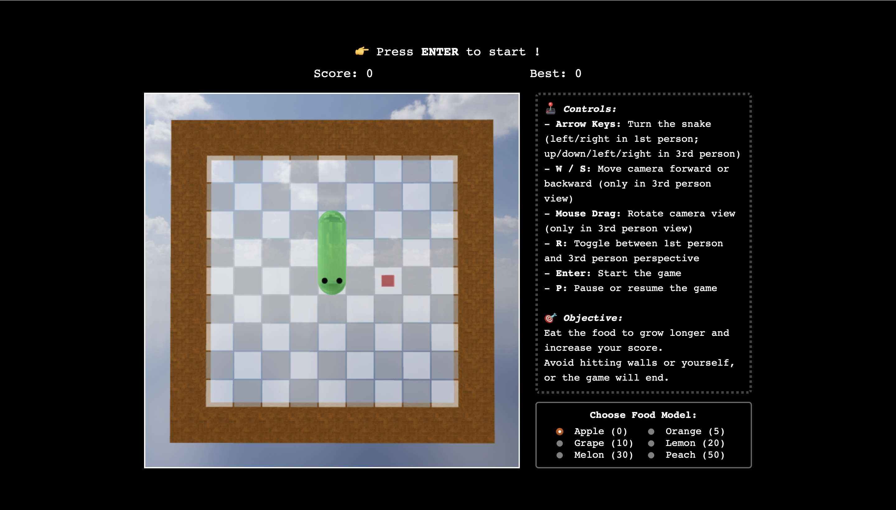

# 🐍 3D Snake Game

A retro-flavored Snake reimagined in 3D, built with raw **WebGL2** + JavaScript. No engines, no frameworks — just shaders, OBJ meshes, and a love for computer graphics.

> Computer Graphics — Final Project · 2026



---

## ✨ Features

- **Real-time WebGL2 rendering** with GLSL shaders written from scratch
- **Skybox** via cube-map environment texture
- **Stone-textured borders** with diffuse + normal mapping
- **Reflective materials** — snake body, food and tiles all sample the cube map
- **Dual camera modes** — toggle between 1st-person (cockpit) and 3rd-person (orbit) view at any time
- **Mouse-orbit camera** in 3rd-person view, with W/S to zoom
- **Per-segment gradient snake body** — head bright green, tail deep teal
- **Six unique food models** with their own meshes, colors and unlock thresholds:
  - 🍎 Apple · 🍊 Orange · 🍇 Grape (cluster) · 🍋 Lemon (ellipsoid) · 🍈 Melon (striped) · 🍑 Peach (twin-lobed)
- **Procedural particle effects** when eating food, plus a death burst on game over
- **Bonus golden food** — spawns randomly, blinks before disappearing, +5 score and a bigger burst
- **Web Audio synth SFX** — every chime, eat, turn, pause, resume, game-over and unlock is generated live with `OscillatorNode`. No audio files needed.
- **Difficulty levels** — Easy / Normal / Hard, controlling base speed, acceleration and floor speed
- **Polished UI overlay** — animated start / pause / game-over screens with state-tinted glow
- **Best-score memory** for the current session

---

## 🎮 Controls

| Key | Action |
|---|---|
| <kbd>↑</kbd> <kbd>↓</kbd> <kbd>←</kbd> <kbd>→</kbd> | Turn the snake (left/right only in 1st-person) |
| <kbd>W</kbd> / <kbd>S</kbd> | Zoom in / out (3rd-person view) |
| Mouse drag | Orbit the camera (3rd-person view) |
| <kbd>R</kbd> | Toggle 1st-person ↔ 3rd-person |
| <kbd>Enter</kbd> | Start / restart the game |
| <kbd>P</kbd> | Pause / resume |

---

## 🚀 Getting started

WebGL needs to be served over HTTP — opening `index.html` directly will fail to fetch the `.obj` and texture files. Use any static server.

### Option 1: Python (built-in)
```bash
cd 3d-snake-game
python -m http.server 8000
```
Open http://localhost:8000/

### Option 2: VS Code Live Server
Install the *Live Server* extension, right-click `index.html` → **Open with Live Server**.

### Option 3: Node http-server
```bash
npx http-server .
```

---

## 🧱 How it works

### Rendering pipeline
- **Skybox** — a single screen-aligned quad sampling a cube map, drawn first with `LEQUAL` depth test so all later geometry can occlude it.
- **Border stones** — repeated cube meshes lit by Phong shading, with a **normal map** perturbing surface normals and a **color map** modulating the base color, all blended with the cube-map reflection.
- **Snake & food** — use the `programPlain` shader: per-fragment Phong lighting, optional cube-map reflection (`mix(lit, reflected, u_ReflectRatio)`) and an emissive term for glowing items.
- **Particles** — small sphere meshes spawned with random velocity and gravity, fading over their lifetime.

### Game loop
The game uses a **recursive `setTimeout`** loop instead of `setInterval`, so the step delay can shrink as the score grows without re-scheduling. The delay is clamped to a per-difficulty floor so the snake never moves faster than the player can react:

```js
function getStepDelay() {
  // base, accel, floor depend on difficulty
  return Math.max(floor, base - score * accel);
}
```

### Audio
All SFX are generated on the fly with the **Web Audio API** — no `.wav`/`.mp3` files in the repo. Each sound is a short `OscillatorNode` with an envelope:
```js
playTone(freq, duration, type, vol, slideTo)
```
Game-over uses a descending sawtooth chord; unlock and bonus use ascending arpeggios; turning is a quick blip; pause/resume are pitch slides.

---

## 📁 File structure

```
3d-snake-game/
├── index.html          # Markup + CSS for HUD, overlay, side-panel UI
├── WebGL.js            # All rendering, game logic, audio, particles
├── cuon-matrix.js      # Vector/Matrix utilities (from the textbook)
├── *.obj               # head / body / turn / sphere / cube meshes
├── px py pz nx ny nz   # 6 cube-map faces for the skybox
├── colorMap.jpg        # Stone diffuse texture for borders
├── normalMap.jpg       # Stone normal map for borders
└── screenshot.png      # Preview image
```

---

## 🐛 Notable fixes / improvements over v1

- ⏱️ **Speed clamp** — old `500 - score * 5` could go ≤ 0 at score ≥ 100. Now a difficulty-aware floor (90 ms hard / 200 ms easy).
- 🐞 **Pause text bug** — the "Game Resumed" → "GAME START" timeout could overwrite the GAME OVER text if the player died within 2 s of unpausing. Now properly cleared on any state change.
- 🖼️ **Lighting** — `programPlain` was previously env-only; now it does per-fragment Phong lighting too, so the snake & food respond correctly to the (animated) light source.
- 🧹 **Game state model** — single `gameStat` enum drives both border color and overlay state.
- 🎨 **Overlay UI** — replaces the old single-line `gamePrompt` text with a full canvas overlay for start / pause / game-over.

---

## 🛠 Tech

- **WebGL 2** (vanilla, no Three.js / Babylon)
- **GLSL** vertex + fragment shaders (5 programs: skybox, env-glass, border, plain, light)
- **Web Audio API** for synthesized sound effects
- **OBJ parser** written from scratch
- Pure HTML + CSS UI — no frameworks

---

## 📜 License

MIT — feel free to fork, learn from, and remix.

---

Made with 🐍 by [@Haooo517](https://github.com/Haooo517)
